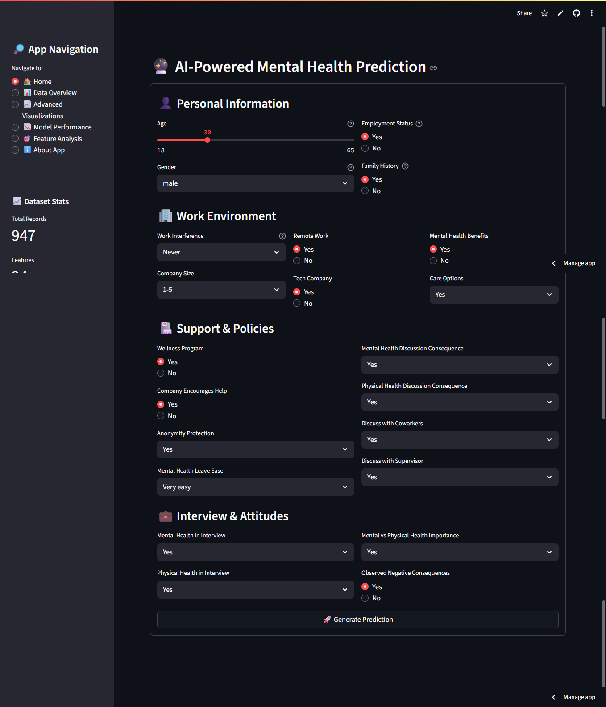
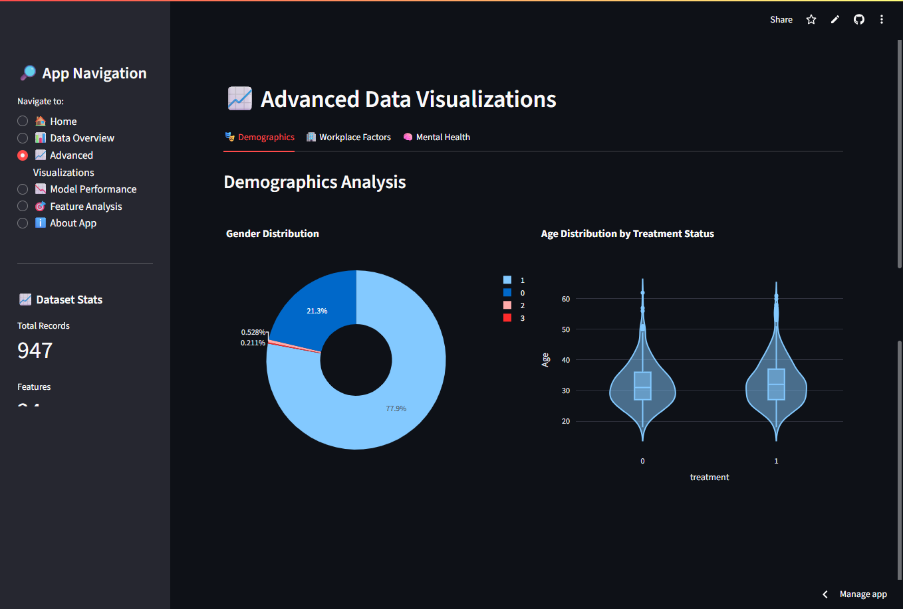
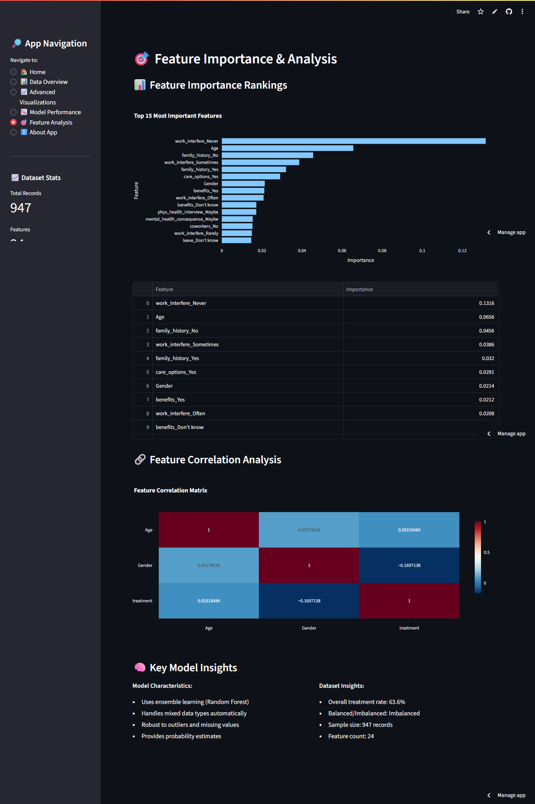

# 🧠 Mental Health Treatment Prediction with Streamlit


A machine learning web application to predict the likelihood of seeking mental health treatment, based on survey responses from tech industry professionals. Built with **Streamlit**, trained using **scikit-learn**, and deployed to **Streamlit Cloud**.

🔗 **[Live Demo](https://mental-health-model-training-6nwixgo3yrtk54z62pdszd.streamlit.app/)**  
📘 **[Dataset (Kaggle)](https://www.kaggle.com/datasets/osmi/mental-health-in-tech-survey)**

---

## 📂 Project Structure

```
mental-health-model-training/
├── app.py # 🎯 Main Streamlit app script
├── model.pkl # 🧠 Trained machine learning model (Random Forest)
├── requirements.txt # 📦 List of required Python packages
├── data/
│ ├── cleaned_survey.csv # ✅ Cleaned dataset used for training
│ ├── survey.csv # 📊 Original dataset downloaded from Kaggle
│ ├── X_test.pkl # 🧪 Test features saved for evaluation
│ └── y_test.pkl # 🧪 Test labels saved for evaluation
├── notebooks/
│ ├── .ipynb_checkpoints # ⚙️ Auto-saved notebook checkpoints (can be ignored)
│ └── model_training.ipynb # 📓 Jupyter Notebook for model training & evaluation
├── screenshots/
│ ├── featureanalysis.png # 📷 Screenshot of feature analysis visual
│ ├── predict.png # 📷 Screenshot of prediction section in the app
│ └── visuals.png # 📷 Screenshot of EDA visualizations
└── README.md # 📘 Project overview and documentation
````

---

## 💡 Features

✅ Real-time prediction of mental health treatment need  
✅ Interactive EDA with charts and filters  
✅ Model performance metrics and comparison  
✅ Responsive sidebar navigation  
✅ Deployed to the cloud (Streamlit Cloud)

---

## 📊 Technologies Used

| Tool | Purpose |
|------|---------|
| 🐍 Python | Core programming language |
| 📘 Pandas | Data manipulation |
| 📈 Seaborn / Plotly | Data visualizations |
| 🤖 Scikit-learn | Model training |
| 🧊 Pickle | Model serialization |
| 🚀 Streamlit | Web app interface and deployment |
| 🐙 Git + GitHub | Version control & hosting |

---

## 🔍 Model Overview

Two models were trained and evaluated:
- ✅ **Random Forest Classifier** (Best performing)
- 📉 Logistic Regression (For comparison)

**Best Model Accuracy**: 84%  
**Evaluation**: Cross-validation, confusion matrix, precision, recall, F1-score

---

## 🚀 Deployment

Deployed using [Streamlit Cloud](https://streamlit.io/cloud).  
To run locally:

```bash
git clone https://github.com/tharushi1019/Mental-Health-Model-Training.git
cd Mental-Health-Model-Training
pip install -r requirements.txt
streamlit run app.py
````

---

## 📷 Screenshots

### 🔮 Prediction Interface



### 📊 Visualizations



### 🎯 Home Page



---

## 📄 License

This project is licensed under the MIT License - see the [LICENSE](LICENSE) file for details.

---

## 🙋‍♀️ Author

**Tharushi Nimnadi**

Feel free to ⭐️ this repo or reach out for collaboration!

---

## 🎓 Acknowledgements

* [Kaggle - Mental Health in Tech Dataset](https://www.kaggle.com/datasets/osmi/mental-health-in-tech-survey)
* [Streamlit Docs](https://docs.streamlit.io/)
* [Scikit-learn Documentation](https://scikit-learn.org/stable/documentation.html)

---
